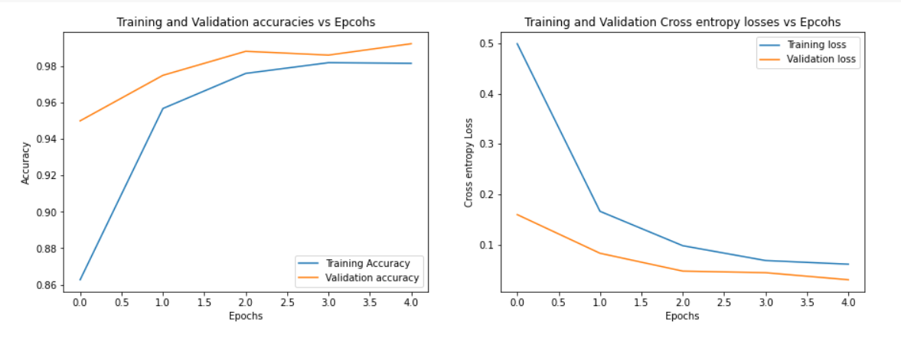

# Transfer Learning Lab

This is my implementation for the Transfer learning lab in the Deep Learning course taught in Zewail City.

## Dataset
The dataset is the large scale fish dataset from kaggle :https://www.kaggle.com/crowww/a-large-scale-fish-dataset

In it, there are images for 10 classes of fish.
We are required to build an image classifier (10 classes), using transfer learning.

## Steps taken
I used 
* `VGG19` `convolutional layers` architecture, with pretrained weights on `imagenet`
* Then I used much simpler `Fully connected layers`, than those in the VGG19 architecture, and at the end used a `softmax` activated layer
* I also used `Batch normalization` for the Fully connected layers

## Results:
The results were really impressive, the `test accuracy` is about `99%` with only 5 epochs of training. This is mainly due to the weights learned from the imagenet data.

### Loss and accuracy across epochs

  

### Confusion matrix:

